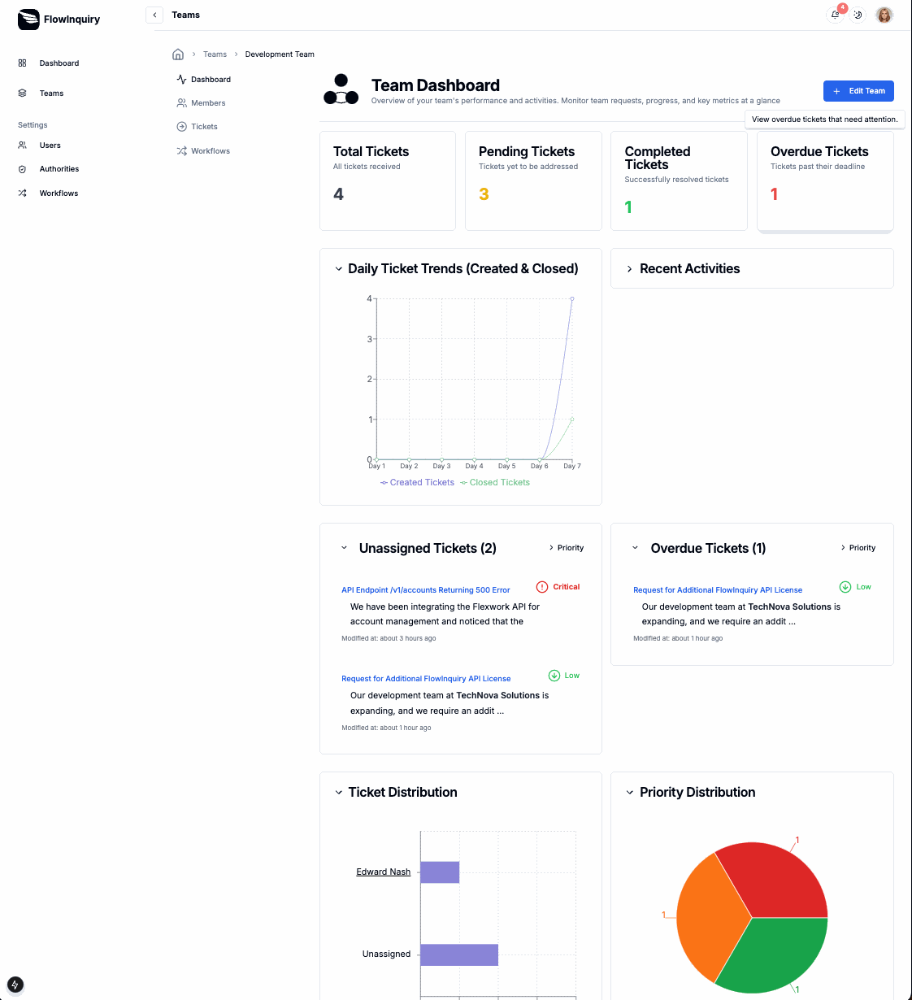

Hi there 👋

Welcome to FlowInquiry – the open-source solution designed to streamline internal and external request management, task tracking, and team collaboration. FlowInquiry supports multiple projects with smart task prioritization, workflow automation, and SLA compliance. As a powerful alternative to Jira, Zendesk, Freshdesk, it simplifies case management and project tracking with AI-powered insights.

Teams can organize work using a Kanban board, manage epics and iterations, and follow Agile practices with ease — making FlowInquiry the perfect fit for modern, agile-driven organizations.

🙋‍♀️ What is FlowInquiry?

FlowInquiry is a centralized hub for managing projects, requests, tasks, and workflows across teams. From on-call support systems to case management in CRM applications, FlowInquiry is flexible, customizable, and built with modern open-source technologies like:

* Spring Framework
* Hibernate
* PostgreSQL
* Next.js
* TailwindCSS
* ShadCn
And more!

🌈 How to Contribute?

We welcome contributions of all kinds — not just code!

You can:
- Star the project ⭐
- Share it on social media 📢
- Create a tutorial or video 🎥
- Report bugs or suggest improvements 🐛
- Submit a pull request 🛠️

Read the full guide: [How to Contribute to FlowInquiry](https://docs.flowinquiry.io/how_to_contributes/your_action_is_meaningful_to_us)
  
